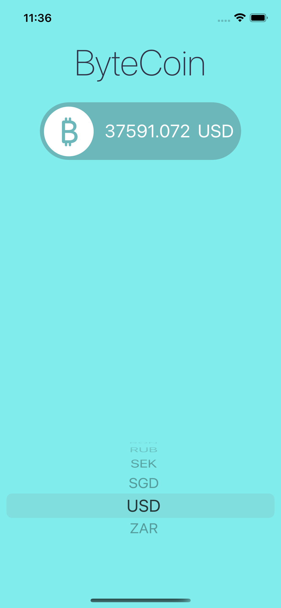
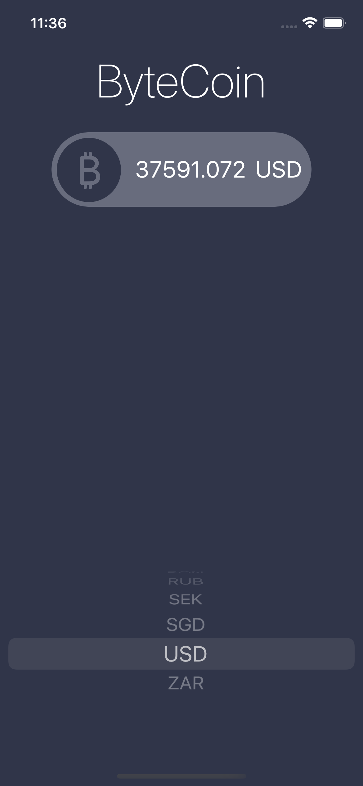
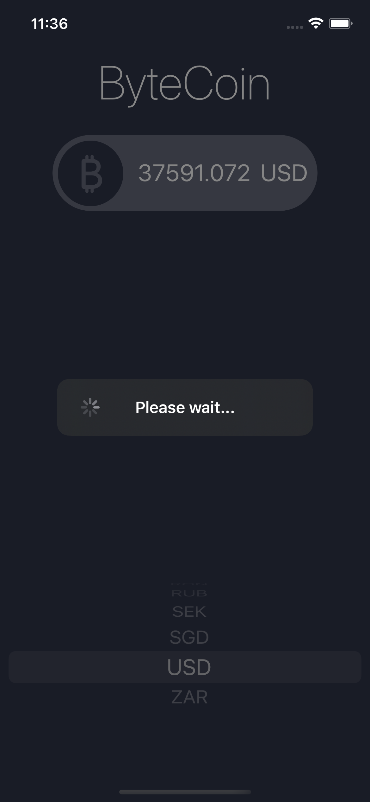

# bitCoin App

An app that shows current exchange rate of the chosen currency, follow the courses by [Angela Yu](https://twitter.com/yu_angela), with some extra features added myself like custom loading view, fully developed in Swift UIKit.

# Menu
* [Screenshots](#screenshots)
* [Features](#features)
* [Source](#source)
* [Contributions](#contributions)
* [Contact](#contact)

# Screenshots

 

* Custom loading View

# Features

* Storyboard implementation
* Custom loading view programmatically
* No third-party library 

# Source
The Udemy courses: [Angela Yu](https://twitter.com/yu_angela), fully developed with Swift UIKit.

### API

[CoinAPI.io](https://www.coinapi.io)

# Contributions

* All kinds of contributions (enhancements, new features, documentation & code improvements, issues & bugs reporting & todo task) are welcome. Let's make it better.

# Contact
Created by [Terry Kuo](https://twitter.com/ArgonYoYo) - feel free to contact me!
